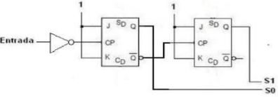
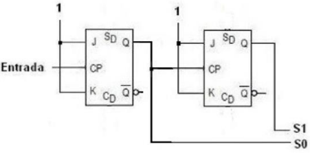

# Sesión 9

## Enunciado

### Ejercicio 1
El circuito de la Figura 2 es un contador asíncrono ascendente de 2 bits, cuyo diseño no es objeto de  esta práctica. En cada flanco de reloj, el número binario S1S0 se incrementa una unidad. 

Cuando se alcanza el valor máximo (11), el siguiente valor es el inicial (00). Monta el circuito de la  Figura 2. Recuerda poner las entradas Enable a 1 de forma permanente, así como las entradas J y K, y  poner pulsadores en las entradas asíncronas Preset y Clear (SD y CD en la Figura 2, respectivamente). Entrada debe ser un reloj sacado del menú Wiring y fijado a 1 Hz. Por defecto los biestables se disparan en el flanco de subida (no cambies esa opción).

Realiza la simulación, inicializando los dos biestables a 0 con las entradas asíncronas Clear (CD en la  Figura 2). Comprueba su correcto funcionamiento.

### Ejercicio 2

Una vez hecho, monta el circuito de la Figura 3, conectando la salida del primer biestable (no la salida  negada como en la Figura 2) a la entrada de reloj del siguiente biestable. Inicializa los dos biestables a  1 con las entradas asíncronas Preset (SD en la Figura 3) y usa un reloj de 1Hz como en el apartado  anterior. ¿Cuál es ahora la secuencia de cuenta?

### Ejercicio 3
Implementa un contador doble (en la sección Ejercicio 3) compuesto por dos subcircuitos C1 (contador asíncrono  ascendente de 2 bits, Ejercicio 1) y C2 (contador asíncrono descendente de 2 bits, Ejercicio 2). El número inicial  de cuenta de C1 debe ser 0 (00) y el de C2 debe ser 2 (10). Cuando ambos contadores cuenten el mismo  número, un LED amarillo debe iluminarse.

- Usar dos displays (Hex Digits Display) para visualizar ambos números.

- Los displays y los LEDs están en el menú Input/Output.

- Simular el circuito con un reloj de 1 Hz.

**AVISO IMPORTANTE: Para que ambos contadores vayan sincronizados (cambien en el mismo instante de  tiempo), es NECESARIO quitar el inversor que hay en la entrada de la Figura 2, mientras que el circuito de la Figura 3 se puede usar según está.**

## Entrega

[CastillejoBravo_Paula-sesion9.circ](CastillejoBravo_Paula-sesion9.circ)